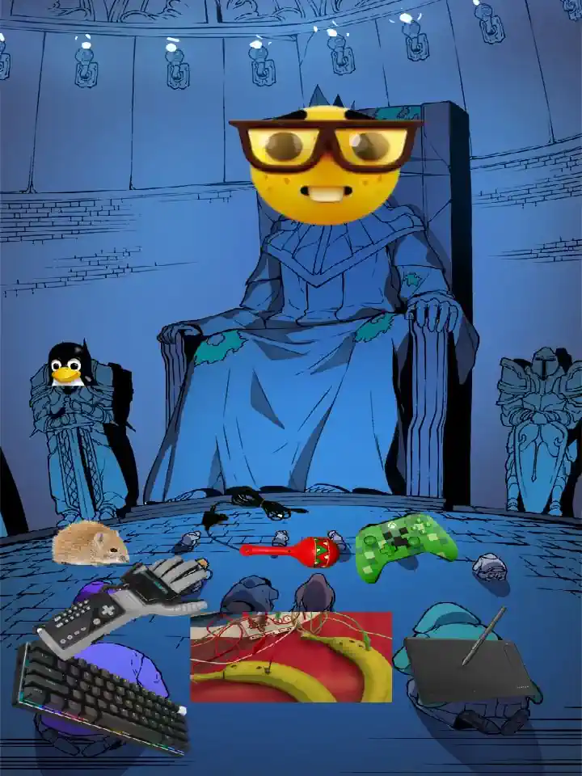

<div align="center">


<br>

"Any button, any input from any peripheral, triggers anything on your system" <br>
[Install](#installation) • [Commands](#commands) • [Configuration](#configuration) • [Behaviors](#behaviors) • [Key Names](#key-names)


<a href="https://github.com/DeprecatedLuar/akeyshually/stargazers">
  
</a>
<a href="https://github.com/DeprecatedLuar/akeyshually/blob/main/LICENSE">
  
</a>
<a href="https://github.com/DeprecatedLuar/akeyshually/releases">
  
</a>

</div>

---

> Errm... Akeyshually, this is NOT a keyboard remapper but an
evdev-based userspace daemon configured in TOML that intercepts
raw input events from any evdev hardware, performs stateful
modifier tracking, and executes arbitrary shell commands through
a fire-and-forget subprocess model regardless of session type or
graphical environment manager. And it also does remapping. 

<br>

<div align="center">
  
</div>

---

## Installation

 

### Universal
```bash
curl -sSL https://raw.githubusercontent.com/DeprecatedLuar/the-satellite/main/satellite.sh | bash -s -- install DeprecatedLuar/akeyshually
```

### Go
```bash
go install github.com/DeprecatedLuar/akeyshually/cmd/akeyshually@latest
```

Make sure `$GOPATH/bin` (usually `~/go/bin`) is in your `PATH`.

<details>
<summary>Other Install Methods</summary>

<br>

**Manual Install**
1. Download binary for your OS from [releases](https://github.com/DeprecatedLuar/akeyshually/releases)
2. Make executable: `chmod +x akeyshually`
3. Move to PATH: `mv akeyshually ~/.local/bin/`

---

**From Source** (for try-harders)
```bash
git clone https://github.com/DeprecatedLuar/akeyshually.git
cd akeyshually
go build -ldflags="-s -w" -o akeyshually ./cmd/akeyshually
mv akeyshually ~/.local/bin/
```

---

>[!NOTE]
> User must be in `input` group: `sudo usermod -aG input $USER` (logout required)

</details>

>[!NOTE]
> First run auto-generates config files in `~/.config/akeyshually/`. Just run `akeyshually` and you're good.

---

## The ludicrous features you've never seen before



*I'd check out the [Overlay System](#overlay-system) and [Behaviors](#behaviors). That's where it gets fun.*

- I designed it to have zero conflicts with any other remapper or shortcut tool. (keyd, kanata, kmonad, xremap...)
- Dead-simple TOML config. Modular overlays that are portable and shareable by design for absolute no conflicts.
- Declarative config only consumes what you explicitly asked for
- **Actually lightweight** takes about ~3MB binary, <3MB RAM, 0% CPU when idle (as expected)
- You can write literal drivers on steroids on a 10 line file. If its a peripheral akeyshually basically pwns it.
- Advanced triggers and behaviors customization ([see table](#behaviors))
- Its borderline black-market software

---

## Quick Start

**Prerequisites:**
```bash
# Add yourself to the input group (first time only)
sudo usermod -aG input $USER
# then logout and back in
```

**Run akeyshually** — config auto-generates at `~/.config/akeyshually/`:
```bash
akeyshually
```


**Open config and add this shortcut:**
```toml
[shortcuts]
'super+shift+a' = "notify-send 'Errm... whassup doc?'"
```

Press the combo, notification pops.

**Now here's how to make an auto-clicker:**
```toml
"f9.repeat" = "notify-send 'pLe4Se h3Lp mYy S0-uL'"
```
Tap F9 to trigger, tap again to stop.

---

## Configuration

Config lives at `~/.config/akeyshually/`:
- `config.toml` - All-in-one config (settings, shortcuts, command aliases)
- `akeyshually.service` - Systemd service file (with install instructions)

> [!TIP]
> If you wanna see a working example vheck out [my personal config](#personal-config) at the bottom of this section.

### Shortcut Syntax

**Key combinations:**
- Single key: `"print"`, `"super"`, `"f1"`
- With modifiers: `"super+t"`, `"ctrl+alt+delete"`, `"shift+print"`
- Modifiers: `super`, `ctrl`, `alt`, `shift` (lowercase)
- Use `+` to combine modifiers and keys

**Dot notation:**
- Triggers define when the command fires: `.onpress`, `.hold`, `.doubletap`, `.pressrelease`, etc.
- Modifiers change how the command executes: `.switch`, `.repeat`, `.passthrough`
- Chain triggers and modifiers: `"key.hold.repeat"`, `"key.doubletap(200)"`
- Triggers can take parameters: `.hold(500)`, `.doubletap(200)`, `.taphold(200, 500)`

**Alias syntax:**
- Share command across multiple keys: `"f1/f2/f3.switch" = ["cmd1", "cmd2"]`
- Dot modifiers from the last key apply to all: `"a/b.hold"` = `"a.hold"` + `"b.hold"`

**Axis syntax:**
- Axis direction: `"rx+"`, `"abs_y-"` (axis name + direction suffix)
- Remap to scroll: `"rx+" = ">scrollup"`, `"abs_y-" = ">scrolldown"`
- Works with drawing tablets, gamepads, trackballs, any ABS device

**Commands:**
- Direct: `"super+t" = "kitty"`
- Command variable: `"super+t" = "$TERMINAL"` or `"super+t" = "terminal"` (references `[command_variables]`)
- Arrays for specific behaviors: `".pressrelease" = ["press_cmd", "release_cmd"]`

<details id="behaviors">
<summary>Deep Dive on triggers and modifiers:</summary>

<br>

**Triggers** — define when the command fires:

| Trigger | Syntax | Description |
|:--------|:-------|:------------|
| *(default)* / `.onpress` | `"key"` | Executes on key press |
| `.doubletap` / `.doubletap(ms)` | `"key.doubletap(200)"` | Executes on confirmed double-tap |
| `.hold` / `.hold(ms)` | `"key.hold(500)"` | Fire once after hold threshold |
| `.pressrelease` | `"key.pressrelease" = ["cmd", "release_cmd"]` | Execute on press and release (either can be `""`) |
| `.taphold` / `.taphold(tap_ms, hold_ms)` | `"key.taphold(200, 500)"` | Tap once, then tap-and-hold on next press |
| `.longpress` / `.longpress(ms)` | `"key.longpress(500)"` | Fire once after threshold (one-shot) |
| `.holdrelease` / `.holdrelease(ms)` | `"key.holdrelease(500)" = ["hold_cmd", "release_cmd"]` | Execute at hold threshold and on release |
| `.taplongpress` / `.taplongpress(tap_ms, long_ms)` | `"key.taplongpress" = ["tap_cmd", "long_cmd"]` | Tap once, or tap-then-longpress |
| `.tappressrelease` / `.tappressrelease(tap_ms)` | `"key.tappressrelease(200)" = ["press_cmd", "release_cmd"]` | Tap then press fires first, release fires second |
| `.tapholdrelease` / `.tapholdrelease(tap_ms, hold_ms)` | `"key.tapholdrelease" = ["hold_cmd", "release_cmd"]` | Tap then hold fires first, release fires second |

**Modifiers** — change how the command executes:

| Modifier | Syntax | Description |
|:---------|:-------|:------------|
| `.switch` | `"key.switch" = ["cmd1", "cmd2"]` | Cycles through a command array |
| `.repeat` | `"key.hold.repeat"` | Loops command while held |
| `.passthrough` | `"key.passthrough"` | Ignores modifiers when matching |

**Normal (default):**
```toml
"super+t" = "kitty"  # Executes on key press
```

**Hold (fire once after threshold):**
```toml
"super+m.hold" = "mute"                 # Fire once after default threshold
"super+m.hold(500)" = "mute"            # Fire once after 500ms (no process management)
```

**Repeat while held:**
```toml
"f9.hold.repeat" = "xdotool click 1"     # Repeat every default_interval while held
"f9.onpress.repeat" = "xdotool click 1"  # Toggle: start/stop on each press
```

**Switch (cycle through commands):**
```toml
"super+tab.switch" = ["cmd1", "cmd2", "cmd3"]  # Cycles on each press
```

**Double-tap (execute on quick double-tap):**
```toml
"super.doubletap(200)" = "$LAUNCHER"      # Double-tap within 200ms
"print.doubletap(300)" = "screen-record"  # Works on any single key
```

**Press/Release (dual commands):**
```toml
"super.pressrelease" = ["", "rofi"]            # Release only (modifier tap)
"super+m.pressrelease" = ["mic-on", "mic-off"] # Both press and release
```

**Tap-then-hold:**
```toml
"super+t.taphold" = "hold-cmd"             # Tap once, then tap-and-hold (default timings)
"super+t.taphold(200, 500)" = "hold-cmd"   # Custom tap window (200ms) + hold threshold (500ms)
```

**Long press:**
```toml
"super+h.longpress(1000)" = "shutdown"  # Fire once after 1000ms (one-shot)
```

**Hold and release:**
```toml
"mute.holdrelease" = ["enable-mic", "disable-mic"]        # Push-to-talk: hold to enable, release to disable
"mute.holdrelease(500)" = ["enable-mic", "disable-mic"]   # Custom hold threshold (500ms)
```

**Tap or long press:**
```toml
"super+space.taplongpress" = ["quick-cmd", "long-cmd"]       # Tap fires first, longpress fires second
"super+space.taplongpress(200, 1000)" = ["tap", "longhold"]  # Custom tap (200ms) + long (1000ms) windows
```

</details>

### Settings Reference

Configure daemon behavior in the `[settings]` section:

| Setting | Type | Default | Description |
|:--------|:-----|:--------|:------------|
| `default_interval` | number | `150` | Default interval for `.repeat` behaviors in milliseconds (values < 10 treated as seconds) |
| `disable_media_keys` | boolean | `false` | When `true`, forwards media keys to system instead of intercepting them |
| `shell` | string | `$SHELL` | Shell to use for executing commands (fallback: `sh`) |
| `env_file` | string | - | File to source before executing commands (e.g., `"~/.profile"`) |
| `notify_on_overlay_change` | boolean | `false` | Show desktop notifications when overlays are enabled/disabled |
| `devices` | array | `[]` | Device name substrings to explicitly grab (case-insensitive), e.g. `["Huion", "Xbox", "PlayStation", "DualShock"]` |

**Example:**
```toml
[settings]
default_interval = 150
disable_media_keys = false
shell = "/bin/bash"
env_file = "~/.profile"
notify_on_overlay_change = true
devices = ["Huion Tablet", "Xbox Controller"]
```

<details>
<summary id="key-names">Available Key Names</summary>

<br>

**Modifiers:** `super`, `ctrl`, `alt`, `shift` (can have standalone shortcuts; left/right separation planned for future release)

**Letters:** `a-z`

**Numbers:** `0-9`

**Special keys:** `return`/`enter`, `space`, `tab`, `esc`/`escape`, `backspace`, `delete`, `insert`, `home`, `end`, `pageup`, `pagedown`, `semicolon`/`;`

**Arrows:** `left`, `right`, `up`, `down`

**Function keys:** `f1`-`f24`

**Print screen:** `print`/`printscreen`

**Numpad:** `kp0`-`kp9`, `kpplus`, `kpminus`, `kpasterisk`, `kpslash`, `kpenter`, `kpdot`

**Media keys:** `volumeup`, `volumedown`, `mute`, `brightnessup`, `brightnessdown`, `playpause`/`play`, `nextsong`/`next`, `previoussong`/`previous`, `calc`/`calculator`

**CD controls (legacy):** `playcd`, `pausecd`, `stopcd`, `ejectcd`, `closecd`, `ejectclosecd`

**Gamepad** (canonical names): `btn_south`, `btn_north`, `btn_east`, `btn_west`, `btn_tl`, `btn_tr`, `btn_tl2`, `btn_tr2`, `btn_start`, `btn_select`, `btn_mode`, `btn_thumbl`, `btn_thumbr`

**Gamepad** (Xbox aliases): `gp_a`, `gp_b`, `gp_x`, `gp_y`, `gp_lb`, `gp_rb`, `gp_lt`, `gp_rt`, `gp_ls`, `gp_rs`, `gp_start`, `gp_select`, `gp_guide`

**Gamepad** (PlayStation aliases): `gp_cross`, `gp_circle`, `gp_square`, `gp_triangle`, `gp_l1`, `gp_r1`, `gp_l2`, `gp_r2`, `gp_l3`, `gp_r3`

> **Note:** Xbox and PlayStation names map to the same buttons. Use whichever matches your controller (e.g., `gp_a` = `gp_cross` = `btn_south`).

**Tablet/generic:** `btn_0`-`btn_9`, `btn_tool_pen`, `btn_touch`, `btn_stylus`, `btn_stylus2`

**Axis (absolute):** `x`, `y`, `z`, `rx`, `ry`, `rz`, `abs_x`, `abs_y`, `abs_z`, `abs_rx`, `abs_ry`, `abs_rz`
- Use with direction suffix: `"rx+"`, `"abs_y-"`
- Remap to scroll: `">scrollup"`, `">scrolldown"`, `">scrollleft"`, `">scrollright"` (or `">wheelup"`, `">wheeldown"`, `">wheelleft"`, `">wheelright"`)

**Other:** `102nd`, `ro`

</details>

<details id="personal-config">
<summary>Here is my personal config:</summary>

<br>

```toml
[settings]
default_interval = 150
disable_media_keys = false  # Set to true to let system handle media keys (GNOME/KDE/etc.)
env_file = "~/.profile"

[shortcuts]
"super+k" = "edit_config"
"ctrl+shift+k" = "kill_switch"

#-[LAUNCHERS]--------------------------------

"super.pressrelease" = ["", "hotline"]
"super.doubletap(270)" = "$LAUNCHER"

"super+enter" = "$TERMINAL"
"super+b" = "$BROWSER"
"super+shift+b" = "brave"
"super+e" = "thunderbird"
"super+w" = "whatsapp"
"super+f" = "$FILEMANAGER"
"super+v" = "copyq toggle"
"shift+super+n" = "notetaker"

#-[WINDOW MANAGER]---------------------------

"super+x" = "kill_window"

#-[UTILS]------------------------------------

"print" = "grimblast -f -n copysave area ~/Media/Pictures/screenshots/latest.png"
"print.doubletap" = "last_screenshot"
"super+shift+p" = "last_screenshot"
"super+ctrl+p" = "grimblast -f -n copysave area"
"shift+print" = "grimblast -f -n -o save area"
"super+p" = "grimblast copy area"

"super+y" = "yap toggle & sleep 3 && tcpeek reconnect"

#-[MEDIA KEYS]-------------------------------

"volumeup" = "volume_up"
"volumedown" = "volume_down"
"mute" = "mute_toggle"
"brightnessup" = "brightness_up"
"brightnessdown" = "brightness_down"
"play" = "media_play_pause"
"nextsong" = "media_next"
"previoussong" = "media_previous"

"ctrl+mute" = "mute_mic"
"ctrl+volumeup" = "mic_up"
"ctrl+volumedown" = "mic_down"

[command_variables]#--------------------------

edit_config = "kitty micro ~/.config/akeyshually/config.toml"
kill_switch = "akeyshually stop && pkill -9 akeyshually"

#-[LAUNCHERS]--------------------------------

thunderbird = "thunderbird"
whatsapp = "flatpak run com.rtosta.zapzap"
notetaker = "bash -c \"source ~/.bashrc && notetaker\""

#-[UTILS]------------------------------------

mute_mic = "pactl set-source-mute @DEFAULT_SOURCE@ toggle || wpctl set-mute @DEFAULT_AUDIO_SOURCE@ toggle"
last_screenshot = "$IMAGE_VIEWER ~/Media/Pictures/screenshots/latest.png"

#-[MEDIA COMMANDS]---------------------------

volume_up = "wpctl set-volume -l 1.5 @DEFAULT_AUDIO_SINK@ 5%+"
volume_down = "wpctl set-volume @DEFAULT_AUDIO_SINK@ 5%-"
mute_toggle = "wpctl set-mute @DEFAULT_AUDIO_SINK@ toggle"
brightness_up = "sunset +5"
brightness_down = "sunset -5"
media_play_pause = "playerctl play-pause"
media_next = "playerctl next"
media_previous = "playerctl previous"

mic_up = "wpctl set-volume @DEFAULT_AUDIO_SOURCE@ 5%+"
mic_down = "wpctl set-volume @DEFAULT_AUDIO_SOURCE@ 5%-"
```

<details>
<summary>And here's my overlay for Huion tablet (huion.toml):</summary>

<br>

```toml
[settings]
devices = ["Tablet Monitor Pad", "Tablet Monitor Touch Strip"]

[shortcuts]
# Touchstrip axis → scroll (the reason this project exists!)
"rx-" = ">scrollup"
"rx+" = ">scrolldown"

# Tablet buttons
"btn_0" = ">ctrl+z"
"btn_0.hold" = ">ctrl+shift+z"

"btn_1" = ">w"
"btn_1.hold" = ">ctrl"
"btn_1.taphold" = ">shift"

"btn_3" = "notify-send huion btn_3"
"btn_4" = "notify-send huion btn_4"
```

</details>

<details>
<summary>And here's an example gamepad overlay (gamepad.toml):</summary>

<br>

```toml
[settings]
devices = ["Xbox", "PlayStation"]  # Auto-detects Xbox or PS controllers

[shortcuts]
# Face buttons - Use Xbox or PlayStation naming (both work!)
"gp_a" = "playerctl play-pause"              # Xbox A / PS Cross
"gp_b" = "playerctl next"                    # Xbox B / PS Circle
"gp_cross" = "playerctl play-pause"          # Same as gp_a
"gp_circle" = "playerctl next"               # Same as gp_b

# Shoulders/Triggers - Media controls
"gp_lb" = "volume_down"                      # Left bumper / L1
"gp_rb" = "volume_up"                        # Right bumper / R1
"gp_lt.hold" = "brightness_down"             # Left trigger / L2
"gp_rt.hold" = "brightness_up"               # Right trigger / R2

# Stick clicks
"gp_ls" = "screenshot"                       # Left stick click / L3
"gp_rs" = "notify-send 'Right stick!'"       # Right stick click / R3

# System buttons
"gp_start" = "$LAUNCHER"                     # Start button
"gp_select.doubletap" = "shutdown-menu"      # Select/Back button
"gp_guide.hold(1000)" = "lock-screen"        # Guide/Home button

# Combos
"gp_lb+gp_a" = "take-screenshot"
"gp_start+gp_select" = "toggle-game-mode"
```

</details>

</details>

---

## Axis & Peripheral Support


**akeyshually** supports absolute axis (ABS) events from evdev devices, its an absolute nerd term to say that you can bind:
- **Drawing tablet touchstrips/wheels** - Map touchstrip to scroll, zoom, brush size, etc.
- **Gamepad analog sticks** - Bind stick movement to commands or scroll
- **Trackballs** - Use scroll rings or additional axes
- **Any peripheral with axis input** - If it reports ABS events, it (probably) works

Its still experimental but works, just need more testing and refinement.

**Axis syntax:**
```toml
[shortcuts]
"rx+" = ">scrollup"      # Axis RX positive direction → scroll up
"rx-" = ">scrolldown"    # Axis RX negative direction → scroll down
"abs_y+" = "volume_up"   # Any axis works, any command works
```

**Why? You stupid or smt?:** The entire reason this project feature exists (besides being a natural extension) was to get my Huion Kamvas Pro 13 touchstrip working on NixOS. Traditional shortcut tools only handle keyboard events but have the entire boilerplate backend sitting on there to handle this as well. So I just made any hardware first-class.

See the [Huion overlay example](#personal-config) above for the full config that makes touchstrip scrolling work. and stuff. idk you do you.

---

## Overlay System

This is an override thingie I made to let you enable/disable groups of shortcuts dynamically without any conflicts what so ever and not editing the main `config.toml`.

It's _actually_ very powerful since any config file just works.

**Use Cases:**
- **Gaming**: Override window manager shortcuts so you don't start 9001 instances of firefox.
- **Work profiles**: Different shortcuts for different projects/contexts or programs.
- **Application-specific**: Load shortcuts for specific tools (DAW, IDE, browser, etc.)


**How it works:**
1. Base config (`config.toml`) is always loaded first (I'll change that in the future)
2. Enabled overlays merge on top, overriding base shortcuts
3. `[shortcuts]` and `[command_variables]` from overlays override base
4. `devices` from overlays are appended (deduplicated)
5. Daemon auto-restarts when overlays change

**Commands:**
```bash
akeyshually enable gaming.toml    # Enable overlay and restart daemon
akeyshually disable gaming.toml   # Disable overlay and restart
akeyshually list                  # Show all configs and overlay status
akeyshually clear                 # Disable all overlays
akeyshually config gaming         # Create/edit gaming.toml overlay
```

**Example overlay** (`~/.config/akeyshually/streaming.toml`):
```toml
[shortcuts]
# OBS controls
"f9" = "obs-recording-toggle"
"f10.switch" = ["obs-scene-game", "obs-scene-chat", "obs-scene-brb"]
"f11" = "obs-replay-save"

# Audio controls
"f12.pressrelease" = ["mic-unmute", "mic-mute"]  # Push-to-talk
"ctrl+f12" = "toggle-sound-board"

# Quick alerts
"f1/f2/f3/f4.switch" = ["alert-subscribe", "alert-follow", "alert-donate", "alert-raid"]

[command_variables]
obs-recording-toggle = "obs-cmd recording toggle"
obs-scene-game = "obs-cmd scene switch 'Gaming'"
obs-scene-chat = "obs-cmd scene switch 'Just Chatting'"
obs-scene-brb = "obs-cmd scene switch 'BRB'"
obs-replay-save = "obs-cmd replay save"
mic-unmute = "wpctl set-mute @DEFAULT_AUDIO_SOURCE@ 0"
mic-mute = "wpctl set-mute @DEFAULT_AUDIO_SOURCE@ 1"
toggle-sound-board = "pavucontrol --tab=3"
alert-subscribe = "obs-cmd trigger subscribe-alert"
alert-follow = "obs-cmd trigger follow-alert"
alert-donate = "obs-cmd trigger donate-alert"
alert-raid = "obs-cmd trigger raid-alert"
```

Enable with: `akeyshually enable streaming` (`.toml` extension optional)

---

<!--  -->

## CLI Commands

| Command | Description | Example |
|:--------|:------------|:--------|
| _(none)_ | Run in foreground | `akeyshually` |
| `start` | Daemonize in background | `akeyshually start` |
| `stop` | Stop daemon (pidfile or systemctl) | `akeyshually stop` |
| `restart` | Restart daemon | `akeyshually restart` |
| `enable FILE` | Enable a config overlay | `akeyshually enable gaming` |
| `disable FILE` | Disable a config overlay | `akeyshually disable gaming` |
| `list` | List all configs and overlay status | `akeyshually list` |
| `clear` | Disable all active overlays | `akeyshually clear` |
| `config [FILE]` | Edit a config file in `$EDITOR` | `akeyshually config` |
| `update` | Check for and install updates | `akeyshually update` |
| `version` | Show version | `akeyshually version` |
| `--help` | Show help | `akeyshually --help` |

---

## Why

> When life gives you lemons, don't make lemonade. Make life take the lemons back! GET MAD! I don't want your damn lemons, what the heck am I supposed to do with these?!?

It's very simple, I used to use gnome then I switched from gnome and my shortcuts got vaporized.

So I made something that could store my keybinds across anything. Then I realized the backend could do a lot more stuff that I was in need of like getting my Huion Kamvas Pro 13 touchstrip thing to work on linux since nobody cares about nixos support.

>  Do you know who I am? I'm the man who's gonna burn your house down! With the lemons! I'm gonna get my engineers to invent a combustible lemon that burns your house down! 

---

<details>
<summary>Troubleshooting</summary>

<br>

**"Permission denied" error:**
```bash
groups | grep input  # Verify you're in input group
# If not there:
sudo usermod -aG input $USER
# Then logout and login
```

**"No keyboards detected":**
```bash
ls -l /dev/input/by-id/*kbd*  # Check devices exist
cat /dev/input/event* | head -c 1  # Test evdev access
```

**Shortcut not triggering:**
- Keys must be lowercase in config (`super+t` not `Super+T`)
- Verify command works: `sh -c "your-command"`
- Check logs if running as systemd service: `journalctl --user -u akeyshually`

**Enable debug logging:**
```bash
LOGGING=1 akeyshually
```

</details>

<div align="center">
  
</div>

---

<p align="center">
  <a href="https://github.com/DeprecatedLuar/akeyshually/issues">
    
  </a>
</p>
